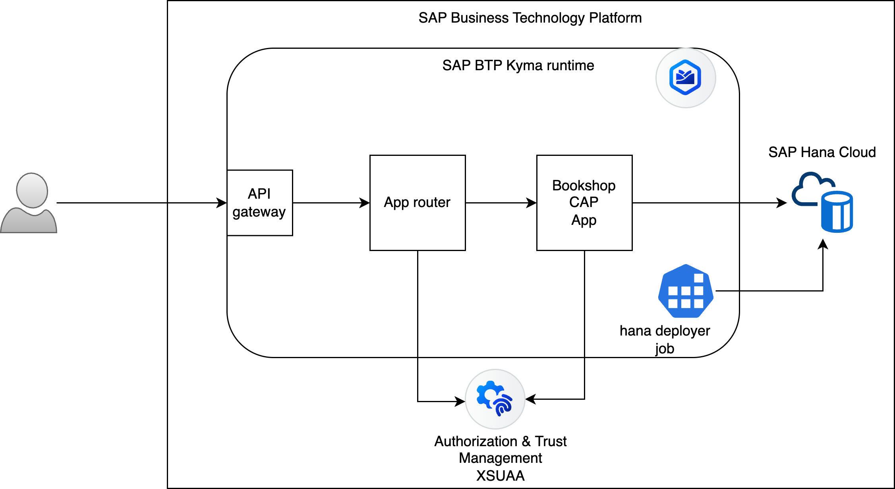
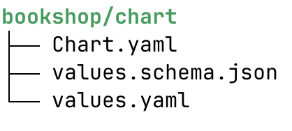

# Overview

Using this sample, you start from scratch to deploy a [CAP](https://cap.cloud.sap/docs/) NodeJS application on SAP BTP, Kyma runtime.



- You create a sample NodeJS-based CAP application, namely the Bookshop.
- You use Core Data Services (CDS) to create the necessary artifacts and configurations required to deploy the application on Kyma.
- You deploy and verify your running CAP application on SAP BTP, Kyma runtime.

> [!Note]
> For simplification most of the commands are defined using the [Makefile](Makefile). If you want to understand what the actual command is, run `make <command> --just-print`.

## Prerequisites

- [SAP BTP, Kyma runtime instance](../prerequisites/README.md#kyma)
- [Docker](../prerequisites/README.md#docker)
- [make](https://www.gnu.org/software/make/)
- [Kubernetes tooling](../prerequisites/README.md#kubernetes)
- [Pack](../prerequisites/README.md#pack)
- [NodeJS 20 or higher](https://nodejs.org/en/download/)
- [SAP CAP](../prerequisites/README.md#sap-cap)
- SAP Hana Cloud Instance
- [SAP Hana Cloud Instance mapped to Kyma](https://blogs.sap.com/2022/12/15/consuming-sap-hana-cloud-from-the-kyma-environment/)

## CAP Application

1. Initialize the CAP Bookshop sample.

   ```shell
   make init
   ```

   The initialized application is a simple Bookshop sample where you can access Book entries using API calls.
      - Data model defined in [./bookshop/db/schema.cds](./bookshop/db/schema.cds). <!-- markdown-link-check-disable-line -->
      - CDS defined in [./bookshop/srv/cat-service.cds](./bookshop/srv/cat-service.cds). <!-- markdown-link-check-disable-line -->

   > [!NOTE]
   > CAP promotes getting started with minimal upfront setup, based on convention over configuration, and a grow-as-you-go approach, adding settings and tools later on, only when you need them. For more information, see [Introduction to CAP](https://cap.cloud.sap/docs/about/).

2. Run the application locally.

   ```shell
   make run-local
   ```

3. Access the CAP Srv at <http://localhost:4004>.
4. Terminate the local running app with `^C`.

## Deploying to Kyma

### Adding the Default Route for Application Router

1. Update the [bookshop/app/router/xs-app.json](bookshop/app/router/xs-app.json) to add a default route for the app router. This is required to access the CAP application via the URL. The end json should look as below: <!-- markdown-link-check-disable-line -->

   ```json
   {
     "welcomeFile": "/odata/v4/catalog/Books",
     "routes": [
       {
         "source": "^/(.*)$",
         "target": "$1",
         "destination": "srv-api",
         "csrfProtection": true
       }
     ]
   }
   ```

   > [!Note]
   > The standalone Application Router is used to simplify the setup and **is not a must**. It should be also possible to use the managed approuter because your CAP APIs are exposed via Fiori or UI5 applications and accessed using workzone.

### Configuring Environment Variables

1. Set up the required environment variables:

   - In shell

      ```shell
      export KUBECONFIG=<your-kubeconfig-file-path>
      export NAMESPACE=<your-kyma-namespace>
      ```

   - In Windows powershell

      ```powershell
      $ENV:KUBECONFIG="<your-kubeconfig-file-path>"
      $ENV:NAMESPACE="<your-kyma-namespace>"
      ```

2. **[Mac users]** Export the DOCKER_HOST.

   ```shell
   export DOCKER_HOST=unix://${HOME}/.docker/run/docker.sock
   ```

### Preparing for Deployment

1. Do a basic check to see if the cluster is reachable. Running any of the basic commands such as `kubectl cluster-info` or `kubectl get pods` or `kubectl get namespaces` successfully should confirm that. If an error occurs, check your kubeconfig file and ensure that it is correctly set up to point to your Kyma cluster. Also, check if the cluster was provisioned successfully in the SAP BTP cockpit under your subaccount.

2. Create a namespace. You can skip this step if you already have a namespace. You can use any non-system namespace of your choice to deploy the sample application.

   > [!Note]
   > The following are system namespaces:
   > - `kube-system`
   > - `istio-system`
   > - `kyma-system`
   > It is not recommended to deploy your applications in the system namespaces.

   ```shell
   make create-namespace
   ```

3. Enable Istio injection for the namespace. Set the kubeconfig context to point to the namespace and create the Docker image pull Secret.
   
   > Note: You will need a Docker API Key so that Kubernetes can pull the Docker images from your Docker account.

   ```shell
   make prepare-kyma-for-deployment
   ```

### Creating Helm Charts

Having the artifacts in place, focus to deploying the application.

First we need the configurations to tell Kyma what and how we want to deploy.

The sample uses [Helm charts](https://helm.sh/) to define the required configurations and then deploy them on the Kyma runtime.

`cds` can intelligently inspect what is defined in your CAP application and generate the necessary configurations (Helm charts) to deploy the application on Kyma runtime.

1. Create a Helm chart.

   ```shell
   make create-helm-chart
   ```

   Take a moment to understand the generated Helm chart in the [chart](./bookshop/chart) directory. <!-- markdown-link-check-disable-line -->

   The Helm chart structure should look as below. The full Helm chart is automatically generated by `cds` under the `gen` folder.

   

   - [bookshop/chart/Chart.yaml](bookshop/chart/Chart.yaml) contains the details about the chart and all its dependencies.<!-- markdown-link-check-disable-line -->
   - [bookshop/chart/values.yaml](bookshop/chart/values.yaml) <!-- markdown-link-check-disable-line --> contains all the details to configure the chart deployment. You will notice that it has sections for `hana deployer`, `cap application` as well as required `service instances` and `service bindings.`

2. Add Istio Destination Rule for the Application Router. Please check the [Approuter documentation](https://www.npmjs.com/package/@sap/approuter) for details about the `PLATFORM_COOKIE_NAME` configuration.

   ```shell
   make add-istio-destination-rule
   ```

3. Update the [bookshop/chart/values.yaml](bookshop/chart/values.yaml) to add the environment variables for the **approuter section** that is used for cookies. <!-- markdown-link-check-disable-line -->

   ```yaml
     health:
       liveness:
         path: /
       readiness:
         path: /
     env:
       PLATFORM_COOKIE_NAME: KYMA_APP_SESSION_ID # This is the cookie name used by the approuter to store session information
   ```

### Building and Deploying

1. Add containerize.

   ```shell
   make add-containerize
   ```

2. Build and deploy to Kyma runtime.

   ```shell
   make cds-build-deploy
   ```

### Verifying the Deployment

To verify your deployment, access the application using the app router URL. It should be similar to this one: <https://bookshop-approuter-${NAMESPACE}.${KYMA_CLUSTER_DOMAIN}>.

### Cleaning Up

1. Delete the Helm chart. Deleting the Helm chart you remove all the deployed applications, service instances, and their bindings.

   ```shell
   make undeploy
   ```

2. Remove the namespace and the Bookshop CAP application folder.

   ```shell
   make cleanup
   ```

## Detailed Path

For more information on the built artifacts and deploying them step by step, see [Detailed Path](./the-detailed-path.md).

## CAP Version

The sample uses the following CAP versions.

| bookshop               | "Add your repository here" |
|------------------------|----------------------------|
| @cap-js/asyncapi       | 1.0.3                      |
| @cap-js/openapi        | 1.2.2                      |
| @sap/cds               | 8.9.4                      |
| @sap/cds-compiler      | 5.9.2                      |
| @sap/cds-dk (global)   | 8.9.4                      |
| @sap/cds-fiori         | 1.4.1                      |
| @sap/cds-foss          | 5.0.1                      |
| @sap/cds-mtxs          | 2.7.2                      |
| @sap/eslint-plugin-cds | 3.2.0                      |
| Node.js                | v22.11.0                   |

## Related Information

[SAP Cloud Application Programming Model](https://cap.cloud.sap/docs/)
